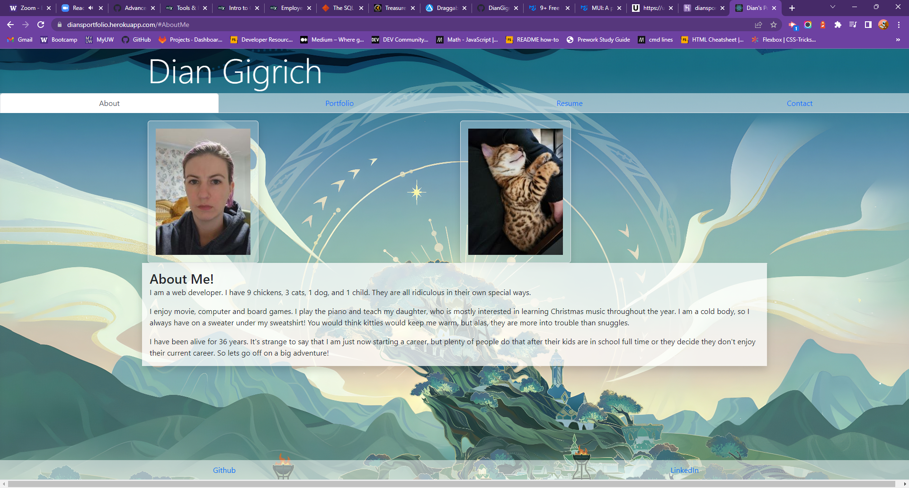

# React Portfolio

## Description
My first React app!  It is a portfolio all about me.  It could use some extra pizzazz, but it'll do for now.
      
## Table of Contents
* [Installation](#installation)
* [Usage](#usage)
* [Screenshot](#screenshot)
* [Credits](#credits)
* [License](#license)
* [Contributing](#contributing)
* [Questions](#questions)
      
## Installation
Once we have our Github, terminal, and vscode ready to go, we need to:
npm i
npm start
      
## Usage
Click on tabs to look at my portfolio, about me, contact page, and resume. 

https://diansportfolio.herokuapp.com/

https://github.com/DianGigrich/portpholio
      
## Screenshot:

## Credits
Joe Rehfuss for teaching us. W3Schools, Mozilla, and StackOverflow. Thanks to the entire internet for bootstrap help.

## License
This application is covered under Creative Commons license. See repo for license.
      
## Contributing
You needn't contribute, but if you'd like to, please follow the rules in the Code of Conduct in repo.
  
## Questions
[Link to diangigrich's GitHub](https://github.com/diangigrich)

[Contact Us](mailto:slayer_barrett_@hotmail.com)